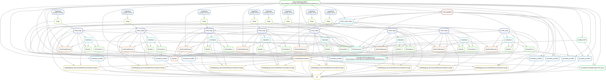

# Snakemake workflow: RNA-seq

## Authors

* Benjamin Fair (@bfairkun)

## Summary

Rules to download and index genome files, align reads with STAR (short reads) or minimap2 (long reads), run basic QC, and quantify gene expression (featureCounts) and splicing (regtools, leafcutter, leafcutter2, SpliSER). Samples from different species can be mixed in one run, as defined in `config/STAR_Genome_List.tsv` and `config/samples.tsv`. Optional differential expression (edgeR) and differential splicing (leafcutter) contrasts, and pyGenomeTracks plot setup.

Because this is usually just the start of an RNA-seq analysis, this workflow is often best used as a submodule of a larger project workflow.

### Dag

Regenerate with:

    snakemake --rulegraph | dot -Tpng > images/dag.png

## Usage

### Step 1: Install workflow and dependencies

Clone the repository, then fetch the submodules (`scripts/leafcutter`, `scripts/leafcutter2`, `scripts/leafcutter2_chao`, `scripts/GenometracksByGenotype`), which the splicing and plotting rules call directly:

    git clone git@github.com:bfairkun/snakemake-workflow_rna-seq.git
    cd snakemake-workflow_rna-seq
    git submodule update --init --recursive

Snakemake itself, plus `samtools`, `bedtools`, and `bc`, must be on `PATH`; most other tools are installed per-rule from `envs/` when running with `--use-conda`.

### Step 2: Configure

Edit `config/config.yaml` and `config/samples.tsv`. Both are validated against `schemas/`, which carries a description for every column.

#### Entry points

A sample can enter the workflow three ways. Whichever is highest in this list wins:

| Priority | Column(s) | What happens |
|---|---|---|
| 1 | `bam` | Already-aligned bam is checked and symlinked into `Alignments/{sample}/` (`rule StageProvidedBam`). No trimming or alignment. |
| 2 | `R1`, `R2` | Local fastq is concatenated, trimmed with fastp, and aligned. |
| 3 | `SRA_accession` | ENA ftp links are looked up at DAG build time, downloaded (aspera if `aspera_key` is set, otherwise wget), then trimmed and aligned. `R1_link`/`R2_link` can be given directly to skip the lookup. |

Rows sharing a `sample` value are combined: multiple fastq rows are concatenated, multiple bam rows are merged. A sample must use one entry point for all of its rows — a bam row and a fastq row for the same sample is an error.

#### samples.tsv columns

| Column | Required | Notes |
|---|---|---|
| `sample` | yes | Must start with a letter or underscore and contain only letters, numbers, underscores, periods. **No hyphens** — sample names become column names in count tables read by R, which mangles them. |
| `STARGenomeName` | yes | Must match a `GenomeName` in `config/STAR_Genome_List.tsv`. |
| `Strandedness` | yes | `U`, `FR`, or `RF`. Cannot be inferred; declare it correctly. |
| `Aligner` | defaults to `STAR` | `STAR` for short reads, `minimap2` for long reads. For a bam-entry sample nothing is aligned, but this still selects which quantification rules the sample flows into (the short-read-only rules are gated on `STAR`). |
| `bam` | — | Path to a coordinate-sorted bam aligned to `STARGenomeName`'s reference. |
| `R1`, `R2` | — | Paths to local fastq.gz. |
| `SRA_accession` | — | SRA run accession. |
| `R1_link`, `R2_link` | — | ftp links, auto-filled from `SRA_accession` if absent. |
| `Library_Layout` | — | `PAIRED` or `SINGLE`. Inferred from whether `R2` is present, **except for bam-entry samples, where it must be given** since there is no `R2` to infer from. |

If the samples file contains many `SRA_accession`s, the ENA lookup runs on every invocation. Run the workflow once to produce `samples.SRA_accession_links_filled.tsv` and point `samples:` at that instead; it has the links (and the outcome of the bam checks) already filled in.

#### config.yaml keys

| Key | Meaning |
|---|---|
| `samples` | Path to the samples tsv. |
| `STAR_genomes` | Path to the genome list tsv. |
| `GenomesPrefix` | Where references and indexes are built: `{GenomesPrefix}{GenomeName}/`. Shared across projects, so an already-built genome is reused. |
| `contrast_group_files_prefix` | Directory of `{ContrastName}.txt` group files (two columns: sample, group) driving differential expression and splicing. Leave blank for none. |
| `scratch` | Directory for large temporary files (bigwig sorting). |
| `aspera_key` | Path to the aspera openssh key. Consumed as an input file by `rule DownloadFromAccession`, so it must point at a file that exists even when downloading over ftp instead. |
| `bam_precheck` | Whether to check provided bams before building the DAG (see below). Default `True`. |

Note that `rule all` writes some QC summaries to `../output/`, i.e. a sibling of the working directory. Running from a `code/` subdirectory of a project, with `output/` alongside it, is the layout this assumes.

### Step 3: Run

    snakemake -n                          # dry run
    snakemake --cores $N --use-conda      # locally
    snakemake --profile snakemake_profiles/slurm   # UChicago RCC Midway

## Providing bams

Bams from another pipeline are only safe here if they were aligned to the same reference this workflow will quantify them against. Two checks enforce that:

* **Before the DAG is built** (`rules/common.py`, skipped if `bam_precheck: False` or `samtools` is not on `PATH`): the bam must exist, be coordinate-sorted, and — if the reference has already been indexed — have chromosome names and lengths agreeing with `Reference.fa.fai`. A bam failing any of these falls back to the `R1`/`R2`/`SRA_accession` given in the same row, with a warning. With no fallback available, the run stops and names every offending sample.
* **At run time** (`rule StageProvidedBam`): chromosome names and lengths are compared to the reference again, and the rule fails loudly on a mismatch. This is what catches the first run against a new reference, where `Reference.fa.fai` did not exist yet when the DAG was built — so on a first run a chromosome mismatch is an error rather than an automatic fallback.

The fallback decision has to be made before the DAG is built, because Snakemake fixes the DAG before any rule runs; a rule can only fail, it cannot reroute a sample to the fastq path.

### Caveats for externally aligned bams

* **Junction strand.** `rule ExtractJuncs` runs `regtools junctions extract -s 0`, which reads the `XS` tag to assign strand. Bams aligned without `--outSAMstrandField intronMotif` (STAR) or without minimap2's `ts` tag will lose junction strand information. This workflow's own STAR and minimap2 rules set these.
* **Duplicates and multimappers.** featureCounts is run with `--ignoreDup --primary`, so duplicate-marked and secondary alignments are dropped. A bam that was already deduplicated, or one where nothing is flagged, is counted differently from one produced by this workflow.
* **Chromosome naming.** Normalization in `rule CountReadsPerSample` sums reads on chromosomes matching `^chr[1-9]`, i.e. UCSC-style names. A reference using Ensembl-style names (`1`, `2`, ...) will stop with an error rather than silently produce an undefined bigwig scale factor.

## Testing

`.test/` holds a small configuration covering all three entry points:

    ./.test/make_test_data.sh                       # writes tiny fastq and a 1-read bam
    snakemake -n --configfile .test/config.yaml     # dry run from the repo root

It overrides only `samples`, `STAR_genomes`, `GenomesPrefix`, `scratch`, and `bam_precheck`; everything else is inherited from `config/config.yaml`.

## Using as a module

This workflow is intended to be reused inside a project workflow, typically as a submodule at `module_workflows/rna_seq`, with the project supplying its own `config/samples.tsv` and contrast group files. `config/STAR_Genome_List.tsv` and `GenomesPrefix` are deliberately shared across projects so references and STAR indexes are built once.

If you intend to modify and further develop this workflow, fork the repository. Please consider providing generally applicable modifications via a pull request.
